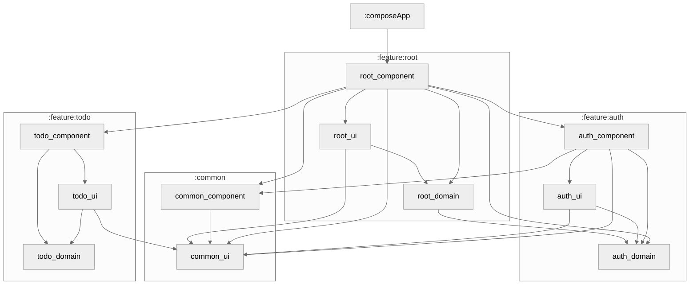

# Work in progress
## Compose Multiplatform Application architecture sample

### Frameworks and libraries

- Compose Multiplatform
- Decompose
- VisualFSM
- Koin DI
- Room Multiplatform

### Key concepts
- FSM based
- Navigation is abstracted from Decompose
- Decompose components are separated into own modules
- Business logic and UI modules do not depend on Component modules
- Component modules are only responsible for routers implementation, DI setup and lifecycle.
- Features are allocated into separate groups of modules,
  each of which is divided into modules with business logic, UI and components with a life cycle.

### Module Graph

### Root module FSM

### Auth module FSM

### Before running!

- check your system with [KDoctor](https://github.com/Kotlin/kdoctor)
- install JDK 17 or higher on your machine

#### Android

To run the application on android device/emulator:

- open project in Android Studio and run imported android run configuration

#### Desktop

Run the desktop application: `./gradlew :composeApp:run`

#### iOS

To run the application on iPhone device/simulator:

- Open `iosApp/iosApp.xcproject` in Xcode and run standard configuration
- Or use [Kotlin Multiplatform Mobile plugin](https://plugins.jetbrains.com/plugin/14936-kotlin-multiplatform-mobile) for Android Studio
  Run iOS simulator UI tests: `./gradlew :composeApp:iosSimulatorArm64Test`