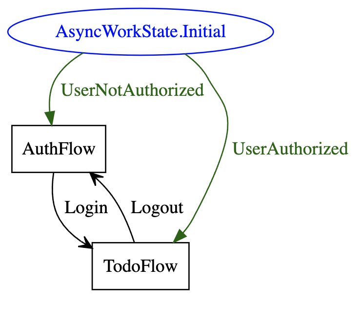

# Work in progress

## Compose Multiplatform Application architecture sample

### Frameworks and libraries

- [Compose Multiplatform](https://github.com/JetBrains/compose-multiplatform)
- [Decompose](https://github.com/arkivanov/Decompose)
- [VisualFSM](https://github.com/Kontur-Mobile/VisualFSM)
- [Koin DI](https://github.com/InsertKoinIO/koin)
- [Room Multiplatform](https://developer.android.com/kotlin/multiplatform/room)

### Key concepts

- FSM based MVI
- Navigation is abstracted from Decompose
- Decompose components are separated into own modules
- Business logic and UI modules do not depend on Component modules
- Component modules are only responsible for routers implementation, DI setup and lifecycle.
- Features are allocated into separate groups of modules,
  each of which is divided into modules with business logic, UI and components with a life cycle.

### Module Graph

### Variants and ready status

| Sample                                                                                                             | Description                                       | Ready status                                                                           |
|--------------------------------------------------------------------------------------------------------------------|---------------------------------------------------|----------------------------------------------------------------------------------------|
| [fsm-mvi-and-mvvm-plus](https://github.com/VasilyRylov/architecture-samples/tree/main)                             | Fsm-based MVI and MVVM+(Todo Feature)             | Working on in-memory repositories, Room Multiplatform WIP in branch room-multiplatform |
| [fsm-mvi](https://github.com/VasilyRylov/architecture-samples/tree/main/fsm-mvi)                                   | Fsm-based MVI with parent and child relation FSMs | Work in progress                                                                       |
| [fsm-mvi-extendable-state](https://github.com/VasilyRylov/architecture-samples/tree/main/fsm-mvi-extendable-state) | Fsm-based MVI with extendable parent state        | Work in progress                                                                       |

### Root module FSM

### Auth module FSM

### Before running!

- check your system with [KDoctor](https://github.com/Kotlin/kdoctor)
- install JDK 17 or higher on your machine

#### Android

To run the application on android device/emulator:

- open project in Android Studio and run imported android run configuration

#### Desktop

Run the desktop application: `./gradlew :composeApp:run`

#### iOS

To run the application on iPhone device/simulator:

- Open `iosApp/iosApp.xcproject` in Xcode and run standard configuration
- Or
  use [Kotlin Multiplatform Mobile plugin](https://plugins.jetbrains.com/plugin/14936-kotlin-multiplatform-mobile)
  for Android Studio
  Run iOS simulator UI tests: `./gradlew :composeApp:iosSimulatorArm64Test`