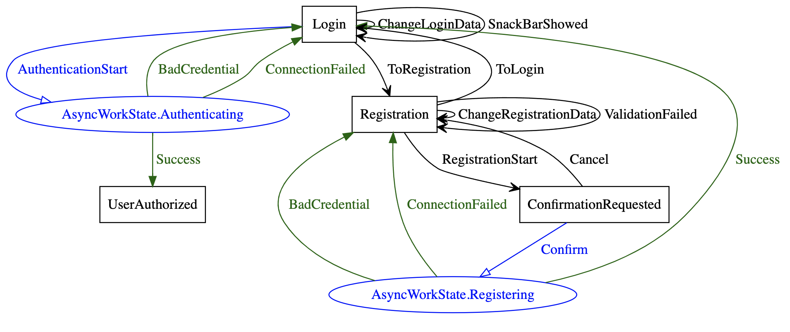
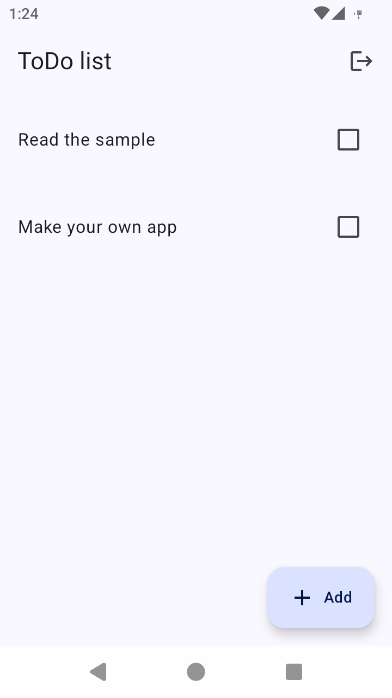

## Compose Multiplatform Application architecture samples

### Frameworks and libraries

- [Compose Multiplatform](https://github.com/JetBrains/compose-multiplatform)
- [Decompose](https://github.com/arkivanov/Decompose)
- [kotlin-inject](https://github.com/InsertKoinIO/koin) or [Koin](https://github.com/InsertKoinIO/koin) DI [variants](#variants-and-ready-status)
- [VisualFSM](https://github.com/Kontur-Mobile/VisualFSM)
- [Room Multiplatform](https://developer.android.com/kotlin/multiplatform/room)

### Key concepts

- FSM based MVI and MVVM+
- Navigation is abstracted from Decompose
- Decompose components are separated into own modules
- Business logic and UI modules do not depend on Component modules
- Multi-module DI, each module can use its own DI framework
- Component modules are only responsible for routers implementation, DI setup and lifecycle.
- Features are allocated into separate groups of modules,
  each of which is divided into modules with business logic, UI and components with a life cycle.

### Module Graph

### Variants and ready status

| Sample                                                                                                        | Description                                                                  | Ready status     |
|---------------------------------------------------------------------------------------------------------------|------------------------------------------------------------------------------|------------------|
| [fsm mvi, mvvm plus, kotlin-inject](https://github.com/VasilyRylov/architecture-samples/tree/main)            | Fsm-based MVI(root and auth features), MVVM+(todo feature), kotlin-inject DI | Ready            |
| [fsm mvi, mvvm plus, Koin](https://github.com/VasilyRylov/architecture-samples/tree/mvi-and-mvvm-koin)        | Fsm-based MVI(root and auth features), MVVM+(todo feature), Koin DI          | Ready            |

### Root module FSM

### Auth module FSM

### Screenshots

<table width="100%">
  <tr>
  <td width="33%">Login</td>
  <td width="33%">Registration</td>
  <td width="33%">ConfirmationRequested</td>
  </tr>
  <tr>
  <td width="33%"></td>
  <td width="33%"></td>
  <td width="33%"></td>
  </tr>
  <tr>
  <td width="33%">Add new todo</td>
  <td width="33%">Todo list</td>
  <td width="33%">Todo details</td>
  </tr>
  <tr>
  <td width="33%"></td>
  <td width="33%"></td>
  <td width="33%"></td>
  </tr>
</table>

### Before running!

- check your system with [KDoctor](https://github.com/Kotlin/kdoctor)
- install JDK 17 or higher on your machine

#### Android

To run the application on android device/emulator:

- open project in Android Studio and run imported android run configuration

#### Desktop

Run the desktop application: `./gradlew :composeApp:run`

#### iOS

To run the application on iPhone device/simulator:

- Open `iosApp/iosApp.xcproject` in Xcode and run standard configuration
- Or
  use [Kotlin Multiplatform Mobile plugin](https://plugins.jetbrains.com/plugin/14936-kotlin-multiplatform-mobile)
  for Android Studio
  Run iOS simulator UI tests: `./gradlew :composeApp:iosSimulatorArm64Test`